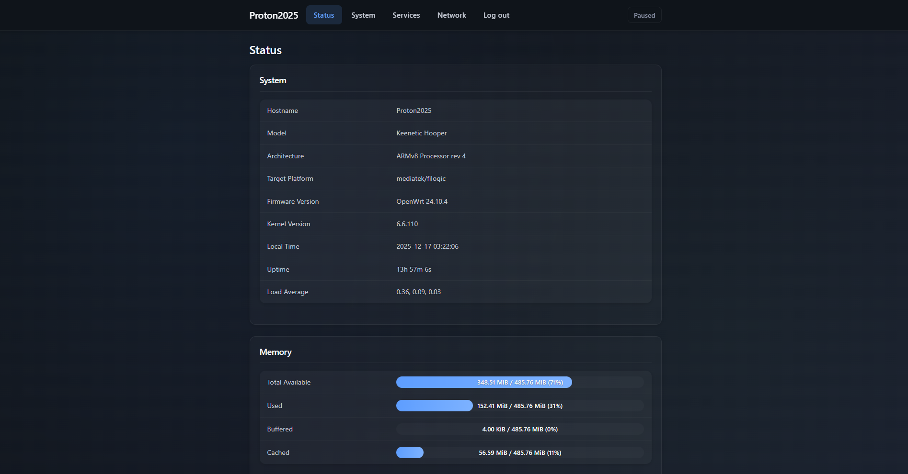
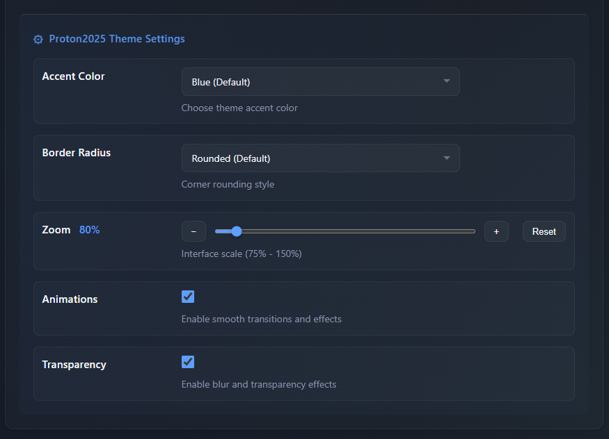

# luci-theme-proton2025

Элегантная тёмная тема для LuCI (OpenWrt 23.x+).


## Скриншоты

### Статус LuCI

<div align="center">
  
</div>

### Настройки темы

<div align="center">
  
</div>

## Особенности

- 🌙 Тёмный glass/blur дизайн
- 🎨 Настраиваемый акцентный цвет, скругление, масштаб
- 📱 Адаптивная вёрстка для мобильных устройств
- ⚡ Совместимость с LuCI ucode (OpenWrt 23.x+)
- 📊 Виджет мониторинга сервисов на странице Status → Overview
- 🌡️ Виджет температуры с мониторингом термодатчиков
- 📈 Элегантная визуализация Load Average с цветовой индикацией и прогресс-барами
- 🌐 Поддержка локализации (i18n)

## Виджеты

### Виджет сервисов

На главной странице (Status → Overview) отображается виджет с состоянием системных сервисов:

- Визуализация статуса (Running/Stopped)
- Добавление сервисов через модальное окно или ввод имени
- Настройки сохраняются в браузере

### Виджет температуры

Мониторинг температуры в реальном времени на Status → Overview:

- Чтение данных из `/sys/class/thermal/` и `/sys/class/hwmon/`
- Цветовая индикация уровней (Норма, Тепло, Горячо, Критично)
- Отслеживание пиковой температуры
- Автообновление каждые 5 секунд
- Встроенный ucode RPC модуль (без внешних зависимостей)

## Настройки темы

Доступны в **System → System → Language and Style**:

- Акцентный цвет (Blue, Purple, Green, Orange, Red)
- Скругление углов
- Масштаб интерфейса
- Анимации и прозрачность
- Виджет сервисов (вкл/выкл, группировка, лог)

## Установка

### Рекомендуется: Установка из IPK пакета

Скачайте последний релиз для вашей архитектуры:

```bash
# Для MediaTek Filogic (aarch64_cortex-a53)
wget https://github.com/ChesterGoodiny/luci-theme-proton2025/releases/latest/download/luci-theme-proton2025_*_all.ipk
opkg install luci-theme-proton2025_*_all.ipk
```

Или скачайте вручную из [GitHub Releases](https://github.com/ChesterGoodiny/luci-theme-proton2025/releases).

**Преимущества:**

- ✅ Включены скомпилированные переводы
- ✅ Правильное управление пакетами (лёгкое обновление/удаление)
- ✅ Отслеживание зависимостей

### Быстрая установка (Только для тестирования)

> ⚠️ **Внимание:** Этот метод предназначен для тестирования. Переводы могут не работать, если релиз ещё не создан на GitHub.

```bash
wget -qO- https://raw.githubusercontent.com/ChesterGoodiny/luci-theme-proton2025/main/install.sh | sh
```

Или:

```bash
curl -fsSL https://raw.githubusercontent.com/ChesterGoodiny/luci-theme-proton2025/main/install.sh | sh
```

### Сборка .ipk из исходников

```bash
cp -r luci-theme-proton2025 ~/openwrt/feeds/luci/themes/
cd ~/openwrt
./scripts/feeds update -a && ./scripts/feeds install -a
make menuconfig  # LuCI -> Themes -> luci-theme-proton2025
make package/luci-theme-proton2025/compile V=s
```

## Удаление

```bash
wget -O uninstall.sh https://raw.githubusercontent.com/ChesterGoodiny/luci-theme-proton2025/main/uninstall.sh
chmod +x uninstall.sh
./uninstall.sh
```

### Откат на стандартную тему

```sh
uci set luci.main.mediaurlbase=/luci-static/bootstrap
uci commit luci
/etc/init.d/uhttpd restart
```

## Структура

```
luci-theme-proton2025/
├── Makefile
├── htdocs/luci-static/
│   ├── proton2025/
│   │   ├── cascade.css
│   │   ├── services-widget.js
│   │   ├── translations.js
│   │   ├── icons/
│   │   └── logo.svg
│   └── resources/menu-proton2025.js
├── root/
│   ├── etc/uci-defaults/
│   │   └── 30_luci-theme-proton2025
│   └── usr/share/rpcd/
│       ├── acl.d/luci-theme-proton2025.json
│       └── ucode/luci.proton-temp
└── ucode/template/themes/proton2025/
    ├── header.ut
    ├── footer.ut
    └── sysauth.ut
```

## Лицензия

Apache-2.0
